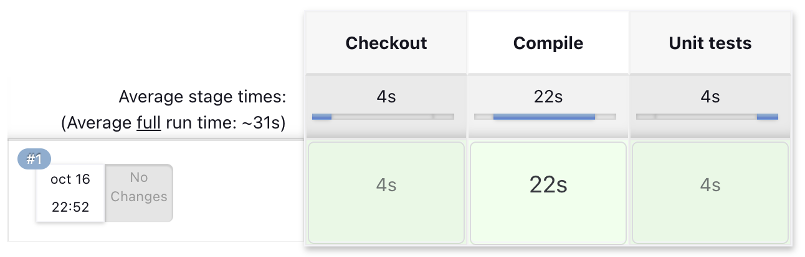
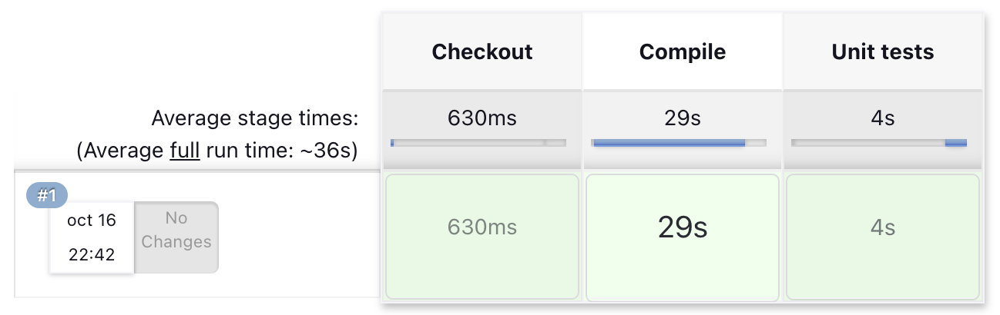

# Bootcamp Devops Continuo - Módulo 4 - CI/CD

## Soluciones a ejercicios Jenkins

*NOTA: los comandos y rutas relativas toman como referencia el directorio actual (03-cd/exercises)*

### Ejercicio 1. CI/CD de una Java + Gradle

Se ha utilizado jenkins dockerizado a partir del Dockerfile propuesto, construyendo una imagen y ejecutando un contenedor a patir de ella:

```bash
docker build -t jenkinsgradle -f jenkins-resources/gradle.Dockerfile .
docker run -v jenkinsgradle_home:/var/jenkins_home -p 8080:8080 -p 50000:50000 jenkinsgradle
```

Se ha creado un repositorio público de GitHub con el código de la aplicación de ejemplo para descargarlo desde el pipeline: https://github.com/gamarr0/lemoncode-calculator

Creamos un job de tipo Pipeline en el que para el paso de obtener el código de un repositorio remoto utilizamos el step checkout que nos proporciona el plugin de git (que viene incluido en los plugins por defecto) y para los pasos de compilación y tests unitarios ejecutamos los comandos utilizando setps sh:

```groovy
pipeline {
  agent any

  stages {
    stage('Checkout') {
      steps {
        checkout scmGit(
          branches: [[name: 'master']],
          userRemoteConfigs: [[url: 'https://github.com/gamarr0/lemoncode-calculator.git']]
        )
      }
    }

    stage('Compile') {
      steps {
        sh './gradlew compileJava'
      }
    }

    stage('Unit tests') {
      steps {
        sh './gradlew test'
      }
    }
  }
}
```
*(solutions/jenkins-01/Jenkinsfile)*



### Ejercicio 2. Modificar la pipeline para que utilice la imagen Docker de Gradle como build runner

El entorno donde se ejecutará el pipeline consistirá en dos contenedores orquestados a través de docker compose, uno para el propio Jenkins y otro para el agente docker donde se levantarán los contenedores que ejecutaran las pipelines que lo requieran.

Empezamos creando un Dockerfile para el contenedor principal de Jenkins, ya que necesitamos extender la imagen de jenkins para instalar el cliente de docker y los plugins necesarios.

```Dockerfile
FROM jenkins/jenkins:lts

USER root
# install docker-cli
RUN apt-get update && apt-get install -y lsb-release
RUN curl -fsSLo /usr/share/keyrings/docker-archive-keyring.asc \
  https://download.docker.com/linux/debian/gpg
RUN echo "deb [arch=$(dpkg --print-architecture) \
  signed-by=/usr/share/keyrings/docker-archive-keyring.asc] \
  https://download.docker.com/linux/debian \
  $(lsb_release -cs) stable" > /etc/apt/sources.list.d/docker.list
RUN apt-get update && apt-get install -y docker-ce-cli

USER jenkins
# install required plugins
RUN jenkins-plugin-cli --plugins docker-plugin:1.5 docker-workflow:572.v950f58993843
```
*(solutions/jenkins-02/Dockerfile)*

Para el agente utilizaremos la imagen oficial de Docker in Docker, por lo que pasamos directamente a definir el entorno utilizando docker compose.

```yaml
services:
  docker:
    image: docker:dind
    container_name: jenkins-docker
    privileged: true
    restart: unless-stopped
    environment:
      DOCKER_TLS_CERTDIR: /certs
    volumes:
      - docker_certs:/certs/client
      - jenkins_home:/var/jenkins_home

  jenkins:
    build: .
    container_name: jenkins
    restart: unless-stopped
    environment:
      DOCKER_HOST: tcp://docker:2376
      DOCKER_CERT_PATH: /certs/client
      DOCKER_TLS_VERIFY: 1
    volumes:
      - docker_certs:/certs/client:ro
      - jenkins_home:/var/jenkins_home
    ports:
      - 8080:8080
      - 50000:50000

volumes:
  docker_certs:
  jenkins_home:
```
*(solutions/jenkins-02/docker-compose.yml)*

Para levantar el entorno utilizamos docker compose, que directamente construira y descargará las imágenes necesarias para crear los contenedores.

```bash
docker compose -f solutions/jenkins-02/docker-compose.yml up
```

En cuanto al pipeline, es igual al del ejercicio anterior pero modificando el agente en el que queremos que se ejecute, indicando que sea `docker` y que utilice la imagen que indica el enunciado (`gradle:6.6.1-jre14-openj9`).

```groovy
pipeline {
  agent {
    docker {
      image 'gradle:6.6.1-jre14-openj9'
    }
  }

  stages {
    stage('Checkout') {
      steps {
        checkout scmGit(
          branches: [[name: 'master']],
          userRemoteConfigs: [[url: 'https://github.com/gamarr0/lemoncode-calculator.git']]
        )
      }
    }

    stage('Compile') {
      steps {
        sh './gradlew compileJava'
      }
    }

    stage('Unit tests') {
      steps {
        sh './gradlew test'
      }
    }
  }
}
```
*(solutions/jenkins-02/Jenkinsfile)*



## Soluciones a ejercicios GitLab

### Ejercicio 1. CI/CD de una aplicación spring


### Ejercicio 2. Crear un usuario nuevo y probar que no puede acceder al proyecto anteriormente creado


### Ejercicio 3. Crear un nuevo repositorio, que contenga una pipeline, que clone otro proyecto, springapp anteriormente creado.


## Soluciones a ejercicios GitHub Actions

### Ejercicio 1. Crea un workflow CI para el proyecto de frontend


### Ejercicio 2. Crea un workflow CD para el proyecto de frontend


### Ejercicio 3. Crea un workflow que ejecute tests e2e


