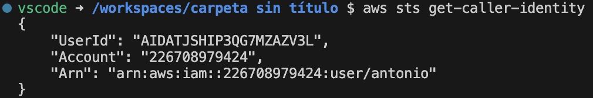
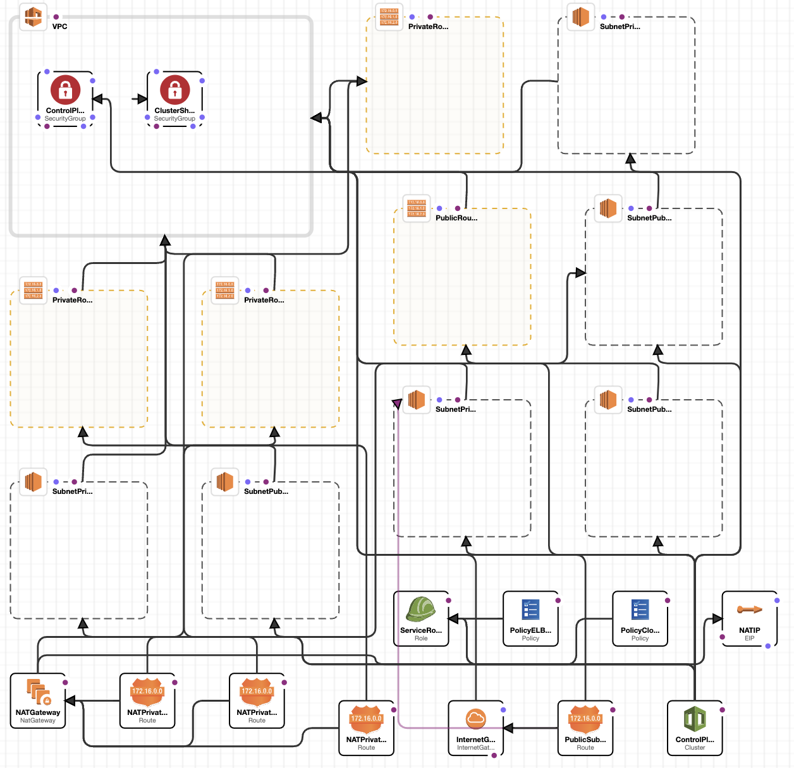
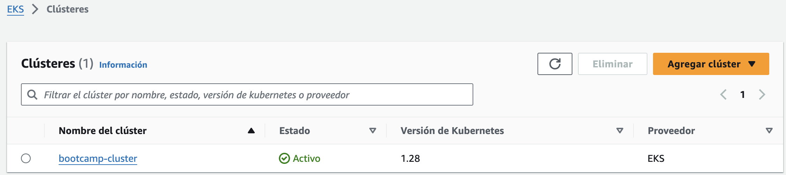
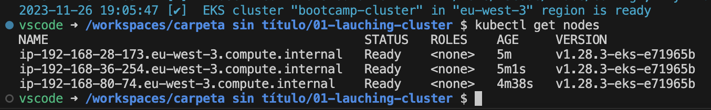
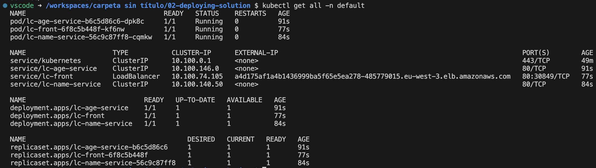
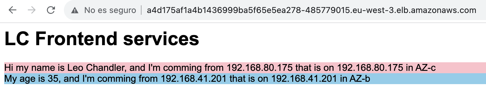
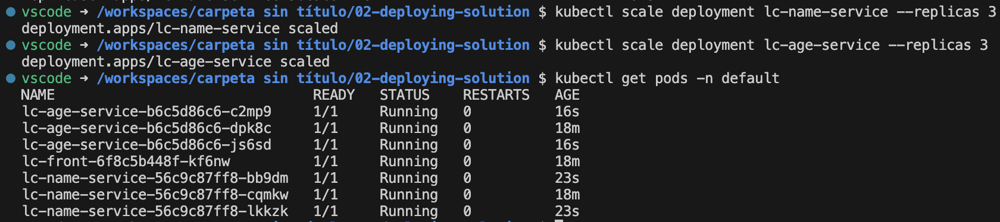
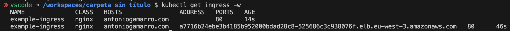
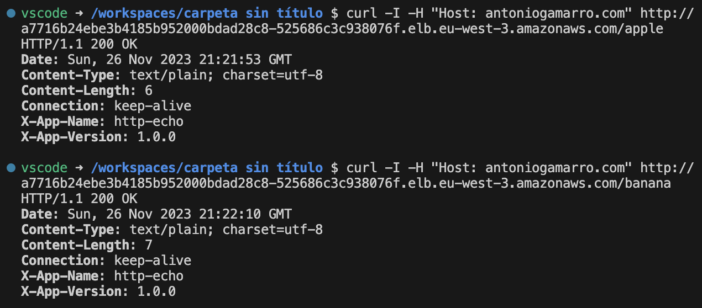

# Bootcamp Devops Continuo - Módulo 5 - Cloud

*NOTA: los comandos y rutas relativas toman como referencia el directorio actual (04-cloud/exercises)*

Se ha elegido la alternativa de Amazon Web Services (EKS) para realizar este laboratorio.

## Configurando el entorno

Instalamos aws cli, kubectl y eksctl en la máquina desde donde vamos a gestionar nuestro clúster.

Desde la consola de AWS, vamos al servicio IAM y creamos un usuario con los permisos necesarios guardando la Access key y su correspondiente Secret key las cuales necesitaremos para autenticarnos desde AWS Cli.

Configuramos aws con las credenciales del usuario creado usando *aws configure*

Comprobamos la credencial activa en aws con *aws sts get-caller-identity*



Creamos par de claves privada/pública para interactuar con las máquinas EC2 si fuese necesario.
```bash
aws ec2 create-key-pair --key-name bootcamp_key --output text > bootcamp_key.pem
chmod 400 bootcamp_key.pem
ssh-keygen -y -f bootcamp_key.pem > bootcamp_key.pub
```

## Creando el cluster

Definimos la configuración del cluster a crear en el siguiente fichero:

```yaml
apiVersion: eksctl.io/v1alpha5
kind: ClusterConfig

metadata:
  name: bootcamp-cluster
  region: eu-west-3
  version: "1.28"

iam:
  withOIDC: true

managedNodeGroups:
  - name: bootcamp-nodes
    instanceType: t2.small
    desiredCapacity: 3
    minSize: 1
    maxSize: 4
    ssh:
      allow: true
      publicKeyPath: "../bootcamp_key.pub"
```
*(01-launching-cluster/cluster.yml)*

Aplicamos el fichero usando **eksctl** (primero con el argumento *--dry-run* para comprobar que la definición es correcta y queda como queremos):

```bash
eksctl create cluster -f 01-launching-cluster/cluster.yaml
```

Desde la consola de aws podemos ver la definición de todo lo que se está creando para el cluster desde el servicio *CloudFormation*.



Una vez creado el cluster, podemos verlo activo en el servicio *EKS* de la consola de aws.



**eksctl** ha configurado **kubectl** automáticamente para poder gestionar nuestro clúster, por lo que podemos interactuar directamente con él por ejemplo para listar los nodos



Vemos que tenemos 3 nodos levantados, que era la capacidad deseada que configuramos al crear el clúster.

## Desplegando la solución

En el directorio *02-deploying-solution* tenemos un directorio por cada servicio que vamos a desplegar, teniendo en cada uno la definición del Deployment y la del Service correspondientes. Los aplicamos todos con **kubectl** para desplegar la aplicación en nuestro clúster.

```bash
kubectl apply -f 02-deploying-solution/lc-age-service/
kubectl apply -f 02-deploying-solution/lc-name-service/
kubectl apply -f 02-deploying-solution/lc-front-service/
```

Los elementos se crean todos en el namespace *default*, ya que no hemos especificado ninguno distinto.



Utiliznado la URL que aparece en la columna *EXTERNAL IP* del servicio *lc-front* (a4d175af1a4b1436999ba5f65e5ea278-485779015.eu-west-3.elb.amazonaws.com) podemos acceder a la aplicación:



La aplicación muestra la respuesta de los servicios *lc-name* y *lc-age* junto con la zona de disponibilidad desde la que responde cada uno, en función del nodo donde se esté ejecutando.

Podemos escalar los deployments de ambos servicios para que se repartan entre los distintos nodos y ver cómo se balancea la carga entre los distintos nodos y que estos están en distintas availability zones.



La aplicación se refresca constantemente y podemos comprobar como cambia la IP y la zona de disponibilidad que responde a las peticiones.

Para eliminar todos los elementos creados podemos eliminar todo lo que se encuentre en el namespace default

```bash
kubectl delete all --all -n default
```

## Exponiendo servicios con ingress

Instalamos el ingress nginx en nuestro cluster aplicando con kubectl el fichero con las definiciones necesarias que podemos encontrar en la documentación:

```bash
kubectl apply -f https://raw.githubusercontent.com/kubernetes/ingress-nginx/controller-v1.8.2/deploy/static/provider/aws/deploy.yaml
```

Aplicamos las definciones de los servicios *apple* y *banana* y del ingress que permitirá acceder a ambos servicios a través de distintas URI, para lo que podemos aplicar directamente las 3 definciones del directorio *03-exposing-services*:

```bash
kubectl apply -f 03-exposing-services/
```

Con **kubectl** podemos listar los ingress hasta que se nos asigne una dirección en amazon para el que acabamos de probar:



Una vez se nos asigna la dirección podemos probarlo utilizando curl para falsear la cabecera Host con nuestro dominio ficticio:



Para terminar eliminamos todos los recursos creados eliminando el cluster completo utilizando eksctl:

```bash
eksctl delete cluster bootcamp-cluster
```
